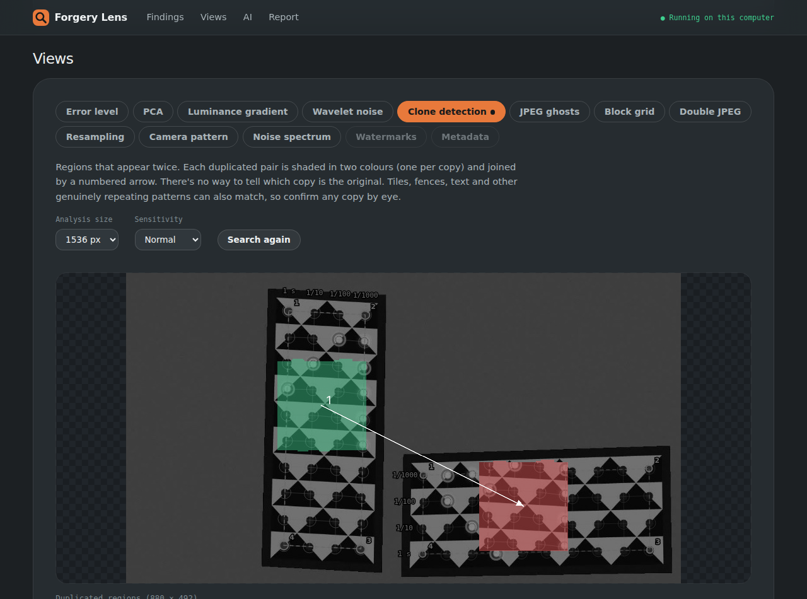
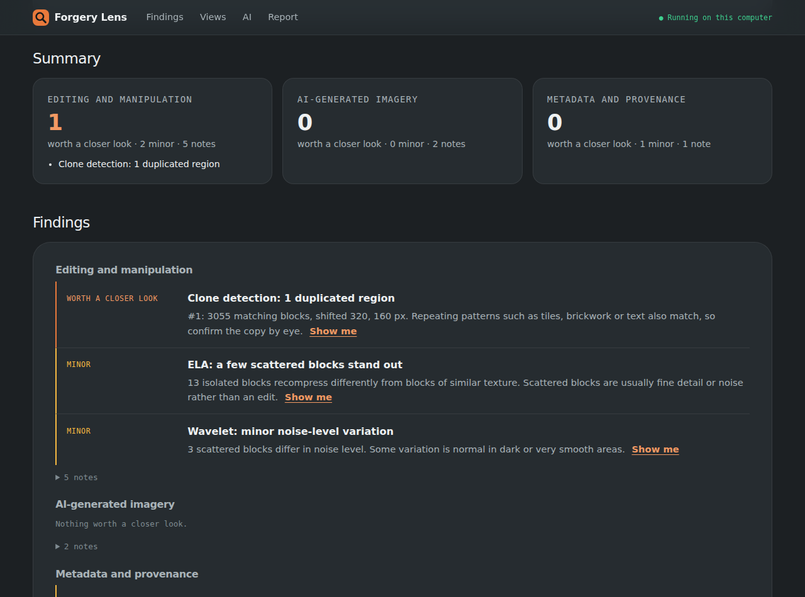

# Forgery Lens

A desktop application that checks an image for signs of editing and of AI generation. It runs thirteen forensic
techniques, among them error level analysis, principal component analysis, luminance gradients, clone detection,
JPEG ghosts, resampling and camera-pattern analysis, plus provenance, watermark and metadata checks. Results come as
findings, full-resolution views and an HTML/JSON report.

It opens in its own native window, using the operating system's web engine through
[pywebview](https://pywebview.flowrl.com/) (Edge WebView2 on Windows, WebKit on macOS, WebKitGTK or Qt on
Linux). **No web server runs and no network port is opened**: the window's JavaScript calls the Python engine
directly. Images are never uploaded anywhere.



## Requirements

- Python 3.10+
- A system web engine:
  - Windows 10/11: Edge WebView2, which is already installed.
  - macOS: nothing extra.
  - Linux: GTK and WebKit2GTK (e.g. `sudo apt install python3-gi gir1.2-webkit2-4.1`), or
    `pip install "pywebview[qt]"`.

## Setup

```bash
python -m venv .venv
.venv\Scripts\python.exe -m pip install -r requirements.txt
```

On macOS/Linux use `.venv/bin/python` in place of `.venv\Scripts\python.exe`.

## Run from source

```bash
.venv\Scripts\python.exe app.py
```

Pass `--debug` to enable the web inspector.

## Build a standalone app

```bash
python -m pip install pyinstaller
python -m PyInstaller --clean ForgeryLens.spec
```

This builds a single file, `dist/ForgeryLens.exe` (`dist/ForgeryLens` on Linux/macOS), with the Forgery Lens
icon. It runs on another machine without Python installed. Each launch unpacks the app to a temp folder first,
so it takes a few seconds to open.

- **Windows:** run `ForgeryLens.exe`. Pin it to the Start menu or taskbar like any other program.
- **macOS:** run `dist/ForgeryLens`.
- **Linux:** copy `dist/ForgeryLens` and `forgerylens.png` to `/opt/ForgeryLens/`, then install
  `forgery-lens.desktop` into `~/.local/share/applications/`.

The icon lives in `forgerylens.ico` (every Windows size, 16–256 px) and `forgerylens.png` (1024 px). To use a
different one, replace those two files and rebuild.

PyInstaller builds for the OS it runs on, so build the Windows `.exe` on Windows.

## Using the app

1. **Open an image.** Click **Browse…** to pick it in your system's own file dialog, type or paste its path, or
   drop the image on the window or paste it. Nothing runs until you press **Analyse**, so you can check the
   **Options** first (open by default): the ELA quality, the clone-search settings, and which techniques to run.
   A progress bar follows the analysis.
2. **Summary and Findings.** These are grouped into editing and manipulation, AI-generated imagery, and metadata
   and provenance. Each finding is marked *worth a closer look* or *minor*, and routine notes are folded away.
   **Show me** jumps to the view that found it.
3. **Views.** There is one tab per technique, and a dot marks tabs with something worth a closer look. Buttons
   switch between each technique's views, e.g. ELA at two qualities, or PC1, PC2, PC3 and the density plot.
   - **Overlay on original** blends the result over the photo, and **Hold to see original** flicks back to it.
   - **Actual pixels** zooms to full resolution.
   - **Save this view** saves a full-resolution PNG where you choose.
   - ELA's sliders and clone detection's settings re-run that technique in the engine.
   - **Measurements and settings** shows the numbers behind each view.
4. **Metadata:** file structure, quantisation tables, EXIF (with GPS), XMP, text chunks and C2PA Content
   Credentials.
5. **Report.** Copy a plain-text summary, or save the full report as HTML (it opens offline), PDF or JSON.
   On Windows the PDF is printed from the HTML report by the app's own web engine (WebView2), on A4 or US Letter
   to match your region. On macOS and Linux it is printed by Microsoft Edge or Google Chrome running in the
   background, so one of them must be installed there.



Recent analyses stay in memory until you close the app. The views you look at are written as PNGs to a
temporary folder, which is deleted when the app closes; nothing else is written to disk except what you save.

## Batch work from the command line

The same engine also runs without the window, for folders of images. Run it from source:

```bash
python app.py analyse photo.jpg --open            # one image, open its report
python app.py analyse evidence/ -r -o reports/    # a whole folder (adds reports/summary.csv)
python app.py techniques                          # list the techniques
```

Each image gets a folder with `report.html`, `report.json` and `maps/`, which holds every view as a
full-resolution PNG. Options:

| Option | Effect |
|---|---|
| `--ela-quality 90` | quality for the main ELA pass (JPEGs also get a pass chosen from their own quality) |
| `--clone-size 1536`, `--clone-sensitivity strict/normal/sensitive` | clone search resolution and strictness |
| `--only ela,clone,ghost` / `--skip spectrum` | choose techniques |
| `--format json`, `--no-maps` | lighter output for batch work |

## What it checks

### Editing and manipulation

| Technique | Looks for | Reference |
|---|---|---|
| **Error level analysis** | Areas that recompress differently from similar texture elsewhere: brighter if saved fewer times, darker if taken from a lower-quality JPEG. Runs at your quality and at one chosen from the file's own quality. | Krawetz 2007 |
| **Principal component analysis** | Compression artefacts in PC3, and a second cluster in the PC1/PC2 plot | |
| **Luminance gradient** | Shading directions that disagree with the scene's lighting | |
| **Wavelet noise** | Regions whose noise level doesn't match areas of similar texture; also the median-filter noise residual | Mahdian & Saic 2009 |
| **Clone detection** | Regions copied within the image, with the shift between them. Repeating patterns and straight edges are set aside. | Fridrich et al. 2003 |
| **JPEG ghosts** | A region that "remembers" an earlier, lower save quality; also estimates the earlier quality of a resaved JPEG | Farid 2009 |
| **JPEG block grid** | Pasted JPEG pieces whose 8×8 grid doesn't line up with the image's, and images cropped after compression (with the offset) | Li, Yuan & Yu 2009 |
| **Double JPEG** | Periodic peaks and gaps in DCT coefficient histograms, left when a JPEG is opened and saved again | Popescu & Farid 2004; Lin et al. 2009 |
| **Resampling** | Periodic interpolation traces from resizing or rotating, in the whole image or in one pasted region | Popescu & Farid 2005; Kirchner 2008 |
| **Camera demosaicing (CFA)** | The camera's colour-filter interpolation pattern, and regions that lack it | Popescu & Farid 2005; Ferrara et al. 2012 |

### AI-generated imagery

| Check | Strength | Notes |
|---|---|---|
| **Provenance** | Strong when present | C2PA Content Credentials (claim generator, IPTC digital source type); XMP `DigitalSourceType` such as `trainedAlgorithmicMedia`; generator settings embedded by Stable Diffusion web UI, ComfyUI, InvokeAI, NovelAI or Fooocus; generator names in EXIF, XMP or text fields |
| **Invisible watermarks** | Strong when found | Decodes the watermarks Stability AI's reference code embeds (SD 1.x, 2.x and XL), with a binomial significance test. They are often switched off, and resizing or recompression destroys them. The decoder is built in and matches the `invisible-watermark` package bit for bit. |
| **Noise spectrum** | Weak on its own | Periodic peaks in the noise residual that JPEG or the camera don't explain; generator upsampling can leave them, but so can resizing |
| **Missing CFA pattern** | Weak | Flagged only when the file claims a camera origin at full quality |
| **Generator-like size** | Very weak | e.g. 1024×1024 or 1216×832, with no camera metadata |

How much to trust these: per-image signal checks for AI generation are not reliable on their own. Test samples
from Stable Diffusion, SDXL and Flux showed no clear spectral fingerprint. The dependable signals are provenance
and watermarks, so the report keeps the weak checks at "minor" and never lets one of them drive a conclusion.

### Metadata and provenance

The tool reads the file's own bytes and checks:
- JPEG segments, quantisation tables (and the quality they imply) and chroma subsampling
- data hidden after the end of the image
- EXIF (including GPS and the embedded thumbnail, which is compared with the image), XMP edit history, PNG and
  WebP chunks, and C2PA manifests

It flags editing software, dimension and thumbnail mismatches, stripped EXIF, and modification after capture.

## Limitations

- Every technique produces false positives. Common causes are fine texture, repeating patterns, heavy
  recompression, out-of-focus areas and high-contrast edges. Every technique can also miss careful work. Findings
  are indicators to guide an examination, not proof, and the report says so.
- Images that have been resized, screenshotted or passed through social media keep far fewer traces. JPEG-based
  checks need a JPEG history, and CFA needs full resolution.
- Heuristics were tuned on a limited set of test images: OpenCV and scikit-image sample photos, planted forgeries,
  and Stable Diffusion, SDXL and Flux samples. Validate them on data like yours before relying on them.
- Stable Diffusion's watermark can't be read back reliably even from untouched dark or low-detail images, and any
  recompression removes it.
- The C2PA reader shows what a manifest claims. It doesn't verify the signature; use `c2patool` or
  contentcredentials.org/verify for that.

## Project structure

```
forgery-lens/
├── backend/
│   ├── api.py            the methods the window calls (window.pywebview.api.*), and the analysis jobs
│   ├── cli.py            command line (analyse, techniques)
│   ├── analyse.py        runs every technique over one image
│   ├── exhibit.py        loading, hashing (images are decoded exactly as stored)
│   ├── metadata.py       JPEG/PNG/WebP/EXIF/XMP/C2PA parsing
│   ├── report.py         HTML/JSON reports and full-resolution maps
│   └── techniques/       one module per technique
├── frontend/             vanilla HTML/CSS/JS UI; styles.css + fonts/ are the shared tool style kit
├── tests/                pytest suite (techniques, metadata, app API); builds its own test images
├── docs/                 screenshots
├── app.py                entry point: opens the native window (no server, no port), or the CLI with a command
├── ForgeryLens.spec      PyInstaller one-file build
├── forgerylens.ico/.png  the app icon
├── forgery-lens.desktop  Linux menu launcher
└── requirements.txt
```

Run the tests with `pip install pytest` then `python -m pytest tests`.

## Licence

To be decided before publishing.
