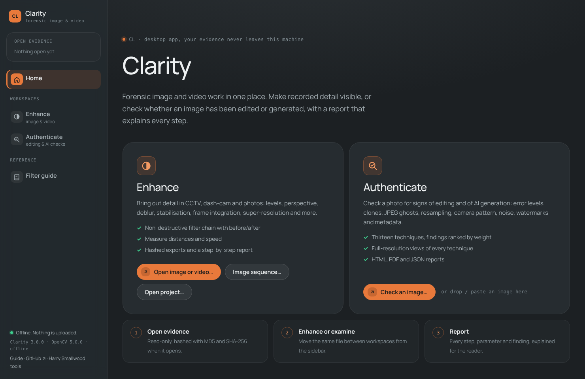
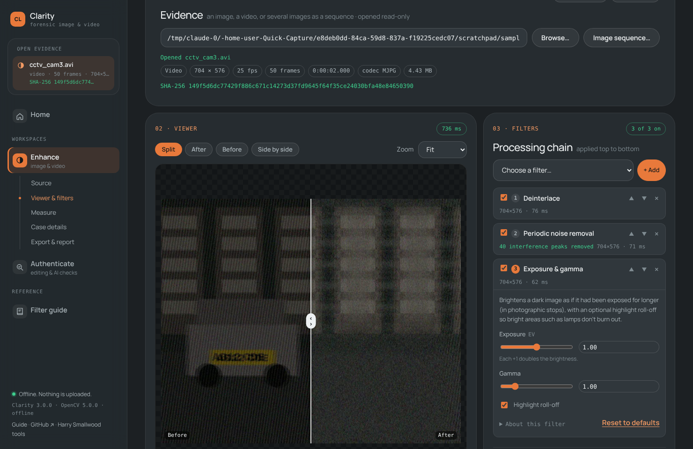
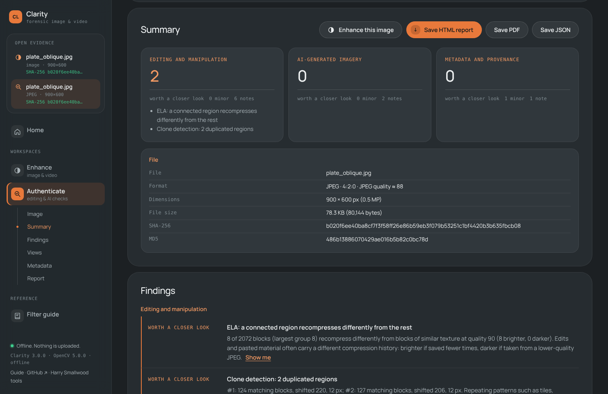

# Clarity

A desktop application for forensic image and video work, with two workspaces in one window:

- **Enhance**: make recorded detail visible in CCTV, dash-cam footage and photos. Build a non-destructive chain of
  31 filters (levels, perspective, deblur, stabilisation, frame integration, super-resolution and more). Compare
  before and after, measure distances and speed, and export with a report that explains every step.
- **Authenticate** (formerly Forgery Lens): check an image for signs of editing and of AI generation with thirteen
  forensic techniques, among them error level analysis, clone detection, JPEG ghosts, resampling and camera-pattern
  analysis, plus provenance, watermark and metadata checks.

It opens in its own native window, using the operating system's web engine through
[pywebview](https://pywebview.flowrl.com/) (Edge WebView2 on Windows, WebKit on macOS, WebKitGTK or Qt on
Linux). **No web server runs and no network port is opened**: the window's JavaScript calls the Python engine
directly. Evidence is never uploaded anywhere.



## Requirements

- Python 3.10+
- A system web engine:
  - Windows 10/11: Edge WebView2, which is already installed.
  - macOS: nothing extra.
  - Linux: GTK and WebKit2GTK (e.g. `sudo apt install python3-gi gir1.2-webkit2-4.1`), or
    `pip install "pywebview[qt]"`.

## Setup

```bash
python -m venv .venv
.venv\Scripts\python.exe -m pip install -r requirements.txt
```

On macOS/Linux use `.venv/bin/python` in place of `.venv\Scripts\python.exe`.

## Run from source

```bash
.venv\Scripts\python.exe app.py
```

Pass `--debug` to enable the web inspector.

## Install on Windows

Download `Clarity-<version>-Setup.exe` (from the repository's **Actions** tab, the latest *Windows installer*
run, under **Artifacts**, or from a release) and run it:

- It installs for you alone by default, into `%LOCALAPPDATA%\Programs\Clarity`, with no administrator prompt.
  The first page offers *install for all users* instead.
- Clarity appears in the **Start menu**, with an optional desktop shortcut.
- It appears in **Settings → Apps**, where it can be uninstalled.
- Images and videos get **Open with → Clarity** in Explorer. Clarity never makes itself the default app;
  choose that in Windows if you want double-click to open it.
- If the Microsoft Edge WebView2 Runtime is missing (it ships with Windows 11 and up-to-date Windows 10), the
  installer offers Microsoft's download page.
- Upgrading is just installing a newer version over the top.

### Windows Defender and SmartScreen

The installer is built to avoid the usual false positives of Python apps:

- **No self-extracting exe.** Clarity is a normal one-folder app. The old single `.exe` unpacked a Python
  runtime to a temp folder on every launch, which is the behaviour antivirus heuristics distrust.
- **A launcher built from source.** PyInstaller's launcher is compiled from source on the build machine
  (`-RebuildBootloader`), so it doesn't match the stock launcher that some malware reuses. The build log
  shows the compiler output and the launcher's hash, and the build stops if the launcher wasn't rebuilt.
- **No UPX compression.**
- **Full version information** (publisher, product, version) on `Clarity.exe` and the installer.

No unsigned program can be guaranteed a clean first run, though. Windows **SmartScreen** shows *"Windows
protected your PC"* for any download without a code-signing reputation; users can choose *More info → Run
anyway*. To remove that warning:

1. **Sign the builds.** Use an Authenticode certificate, or Microsoft's
   [Artifact Signing](https://learn.microsoft.com/azure/trusted-signing/) (formerly Trusted Signing), a low-cost
   monthly service. Add the certificate as repository secrets `CLARITY_SIGN_PFX_BASE64` (the `.pfx`,
   base64-encoded) and `CLARITY_SIGN_PASSWORD`, and every build signs `Clarity.exe`, the installer and the
   uninstaller. Locally, set `CLARITY_SIGN_THUMBPRINT` (a certificate in your store) or `CLARITY_SIGN_PFX` +
   `CLARITY_SIGN_PASSWORD` before building.
2. **If Defender itself ever flags a build**, submit the installer as a false positive at
   <https://www.microsoft.com/wdsi/filesubmission> (choose *Software developer*). Microsoft usually clears it
   within a day or two, for that build and similar later ones.

## Build the installer

Every push to GitHub builds it automatically: see **Actions → Windows installer**. Each run installs the
result, checks that the installed app starts and passes its self-test, uninstalls it, and keeps
`Clarity-<version>-Setup.exe` as a downloadable artifact. Pushing a tag such as `v3.0.0` also attaches it to a
GitHub release.

To build on your own Windows PC (Python 3.10+; Inno Setup 6 is installed automatically if missing):

```powershell
powershell -ExecutionPolicy Bypass -File packaging\build-windows.ps1 -RebuildBootloader
```

`-RebuildBootloader` needs the Visual Studio C++ build tools. Leave it off to use PyInstaller's stock launcher,
which is more likely to be flagged. The steps are in `packaging/build-windows.ps1`:

1. a clean virtual environment;
2. the tests;
3. PyInstaller (`Clarity.spec`, a one-folder build into `dist\Clarity\`);
4. `Clarity.exe --self-test`;
5. optional signing;
6. Inno Setup (`packaging\Clarity.iss`), producing `dist\installer\Clarity-<version>-Setup.exe` with a
   `SHA256SUMS.txt` next to it.

The version comes from `backend/__init__.py`. The icon lives in `clarity.ico` (every Windows size, 16–256 px)
and `clarity.png` (1024 px).

**macOS and Linux:** `python -m PyInstaller --clean --noconfirm Clarity.spec` builds `dist/Clarity/`. On Linux,
copy that folder to `/opt/Clarity/`, copy `clarity.png` into it, and install `clarity.desktop` into
`~/.local/share/applications/`.

## Finding your way around

The **sidebar** on the left is always visible:

- **Open evidence** lists the file open in each workspace, with its type, size and SHA-256. Click one to go
  back to it.
- **Home** has a card for each workspace with its main actions. You can drop or paste an image on Home to check it.
- **Enhance** and **Authenticate** each show their sections underneath (Source, Viewer & filters, Measure…;
  Image, Summary, Findings, Views…). Click a section to jump to it. The one you're reading is highlighted, and
  sections with nothing in them yet are dimmed.
- **Filter guide** explains every enhancement filter, with search and categories.

A file moves between workspaces with one click. In Enhance, **Authenticate this image** checks the still you
have open. In Authenticate's summary, **Enhance this image** opens the analysed file in Enhance. Images that
were dropped or pasted have no path on disk, so they need opening with Browse… first.

On a narrow window the sidebar folds into a bar across the top.

## Enhance



1. **Source**: **Browse…** for an image or video, or **Image sequence…** to treat several photos as frames (e.g.
   photos of the same plate for super-resolution). Files are opened read-only and hashed (MD5 and SHA-256) when
   they open.
2. **Viewer & filters**: add filters to the chain. They run top to bottom, and each can be switched off,
   reordered or retuned at any time. Each step shows its result (e.g. *rectified to 785×532 px*, *frames 22–29,
   8/8 aligned*) and how long it took.
   - The viewer has **Split** (drag the divider), **After**, **Before** and **Side by side** modes, zoom up to
     800 % (pixelated, so you see the real pixels), and a histogram.
   - For video, use the frame slider, ◀ ▶, **← →** (Shift for ±10) and **space** to play.
   - Filters that need points (perspective corners, crop, neutral point, fisheye circle) have
     **⌖ Pick on image**. The viewer shows that step's input; click the points, drag to adjust, then press **Done**.
3. **Measure**: set a scale from something of known length, then measure distances, or speed (km/h and mph)
   between two frames.
4. **Case details** for the report. **Save project** stores the chain, case details and measurements with the
   source's SHA-256. Reopening a project re-checks that hash.
5. **Export & report**:
   - **Export frame**: PNG or TIFF (lossless, 8- or 16-bit), or JPEG.
   - **Export video** for a frame range: lossless FFV1 MKV, Motion-JPEG AVI, MP4, or numbered PNGs with a
     `SHA256SUMS.txt` manifest. Every export is hashed.
   - **Report** (HTML or JSON) contains:
     - the source's hashes, with a statement that the original wasn't modified, and the before/after frame;
     - for **every step**: what it does, why it's used, how it works, its caveats, all parameters (changed ones
       highlighted), its result and a thumbnail after that step;
     - measurements, exports and software versions;
     - an appendix describing **every** available filter.

| Category | Filters |
|---|---|
| Levels & exposure | Levels, Auto contrast stretch, Brightness & contrast, Exposure & gamma, Shadows & highlights (backlit subjects), Histogram equalisation (global / CLAHE) |
| Colour & channels | White balance (grey world, white patch, picked neutral point, manual), Channel select (RGB, HSV, L\*a\*b\*), Invert, Saturation |
| Sharpen & deblur | Unsharp mask, Motion deblur (linear PSF, Wiener or Richardson–Lucy), Optical deblur (defocus disc or Gaussian) |
| Denoise & frequency | Gaussian, Median, Bilateral, Non-local means, Periodic noise removal (automatic FFT notch), Frequency filter (e.g. fingerprints), Background flatten |
| Geometry & perspective | Crop, Rotate & flip, Resize (nearest keeps real pixels), Aspect ratio correction (CCTV 704×576 → 4:3 …), Perspective correction (4 points, optional known ratio) |
| Lens & camera | Lens distortion (Brown–Conrady k1/k2), Unroll 360° camera (panorama or virtual PTZ view), Deinterlace |
| Video & multi-frame | Frame integration (aligned mean/median/sum), Multi-frame super-resolution, Stabilisation (smoothed path or lock to a frame) |

Multi-frame filters see the output of the steps above them for neighbouring frames, so *Deinterlace →
Stabilise → Frame integration* integrates deinterlaced, stabilised frames. Intermediate results are cached
per frame, so moving a slider only re-runs the steps after it.

Enhance's limits:
- Video is decoded with OpenCV's FFmpeg backend, so proprietary DVR formats (`.dav` …) may need remuxing to a
  standard container first.
- Speeds use the container's frame rate. Check it against an on-screen clock.
- Measurements are valid only in the plane of the scale reference.
- Enhancement makes recorded detail visible; it can't create detail that wasn't captured.

## Authenticate



1. **Image.** Click **Browse…** to pick an image, type or paste its path, or drop or paste the image (on Home
   or here). Nothing runs until you press **Analyse**, so you can check the **Options** first: the ELA quality,
   the clone-search settings, and which techniques to run. A progress bar follows the analysis.
2. **Summary and Findings.** These are grouped into editing and manipulation, AI-generated imagery, and metadata
   and provenance. Each finding is marked *worth a closer look* or *minor*, and routine notes are folded away.
   **Show me** jumps to the view that found it.
3. **Views.** There is one tab per technique, and a dot marks tabs with something worth a closer look. Buttons
   switch between each technique's views, e.g. ELA at two qualities, or PC1, PC2, PC3 and the density plot.
   - **Overlay on original** blends the result over the photo, and **Hold to see original** flicks back to it.
   - **Actual pixels** zooms to full resolution.
   - **Save this view** saves a full-resolution PNG where you choose.
   - ELA's sliders and clone detection's settings re-run that technique in the engine.
   - **Measurements and settings** shows the numbers behind each view.
4. **Metadata:** file structure, quantisation tables, EXIF (with GPS), XMP, text chunks and C2PA Content
   Credentials.
5. **Report.** Copy a plain-text summary, or save the full report as HTML (it opens offline), PDF or JSON.
   On Windows the PDF is printed from the HTML report by the app's own web engine (WebView2), on A4 or US Letter
   to match your region. On macOS and Linux it is printed by Microsoft Edge or Google Chrome running in the
   background, so one of them must be installed there.

Recent analyses stay in memory until you close the app. The views you look at are written as PNGs to a
temporary folder, which is deleted when the app closes; nothing else is written to disk except what you save.

### Batch checks from the command line

The Authenticate engine also runs without the window, for folders of images. Run it from source:

```bash
python app.py analyse photo.jpg --open            # one image, open its report
python app.py analyse evidence/ -r -o reports/    # a whole folder (adds reports/summary.csv)
python app.py techniques                          # list the techniques
```

Each image gets a folder with `report.html`, `report.json` and `maps/`, which holds every view as a
full-resolution PNG. Options:

| Option | Effect |
|---|---|
| `--ela-quality 90` | quality for the main ELA pass (JPEGs also get a pass chosen from their own quality) |
| `--clone-size 1536`, `--clone-sensitivity strict/normal/sensitive` | clone search resolution and strictness |
| `--only ela,clone,ghost` / `--skip spectrum` | choose techniques |
| `--format json`, `--no-maps` | lighter output for batch work |

### What it checks

#### Editing and manipulation

| Technique | Looks for | Reference |
|---|---|---|
| **Error level analysis** | Areas that recompress differently from similar texture elsewhere: brighter if saved fewer times, darker if taken from a lower-quality JPEG. Runs at your quality and at one chosen from the file's own quality. | Krawetz 2007 |
| **Principal component analysis** | Compression artefacts in PC3, and a second cluster in the PC1/PC2 plot | |
| **Luminance gradient** | Shading directions that disagree with the scene's lighting | |
| **Wavelet noise** | Regions whose noise level doesn't match areas of similar texture; also the median-filter noise residual | Mahdian & Saic 2009 |
| **Clone detection** | Regions copied within the image, with the shift between them. Repeating patterns and straight edges are set aside. | Fridrich et al. 2003 |
| **JPEG ghosts** | A region that "remembers" an earlier, lower save quality; also estimates the earlier quality of a resaved JPEG | Farid 2009 |
| **JPEG block grid** | Pasted JPEG pieces whose 8×8 grid doesn't line up with the image's, and images cropped after compression (with the offset) | Li, Yuan & Yu 2009 |
| **Double JPEG** | Periodic peaks and gaps in DCT coefficient histograms, left when a JPEG is opened and saved again | Popescu & Farid 2004; Lin et al. 2009 |
| **Resampling** | Periodic interpolation traces from resizing or rotating, in the whole image or in one pasted region | Popescu & Farid 2005; Kirchner 2008 |
| **Camera demosaicing (CFA)** | The camera's colour-filter interpolation pattern, and regions that lack it | Popescu & Farid 2005; Ferrara et al. 2012 |

#### AI-generated imagery

| Check | Strength | Notes |
|---|---|---|
| **Provenance** | Strong when present | C2PA Content Credentials (claim generator, IPTC digital source type); XMP `DigitalSourceType` such as `trainedAlgorithmicMedia`; generator settings embedded by Stable Diffusion web UI, ComfyUI, InvokeAI, NovelAI or Fooocus; generator names in EXIF, XMP or text fields |
| **Invisible watermarks** | Strong when found | Decodes the watermarks Stability AI's reference code embeds (SD 1.x, 2.x and XL), with a binomial significance test. They are often switched off, and resizing or recompression destroys them. The decoder is built in and matches the `invisible-watermark` package bit for bit. |
| **Noise spectrum** | Weak on its own | Periodic peaks in the noise residual that JPEG or the camera don't explain; generator upsampling can leave them, but so can resizing |
| **Missing CFA pattern** | Weak | Flagged only when the file claims a camera origin at full quality |
| **Generator-like size** | Very weak | e.g. 1024×1024 or 1216×832, with no camera metadata |

How much to trust these: per-image signal checks for AI generation are not reliable on their own. Test samples
from Stable Diffusion, SDXL and Flux showed no clear spectral fingerprint. The dependable signals are provenance
and watermarks, so the report keeps the weak checks at "minor" and never lets one of them drive a conclusion.

#### Metadata and provenance

The tool reads the file's own bytes and checks:
- JPEG segments, quantisation tables (and the quality they imply) and chroma subsampling
- data hidden after the end of the image
- EXIF (including GPS and the embedded thumbnail, which is compared with the image), XMP edit history, PNG and
  WebP chunks, and C2PA manifests

It flags editing software, dimension and thumbnail mismatches, stripped EXIF, and modification after capture.

### Limitations

- Every technique produces false positives. Common causes are fine texture, repeating patterns, heavy
  recompression, out-of-focus areas and high-contrast edges. Every technique can also miss careful work. Findings
  are indicators to guide an examination, not proof, and the report says so.
- Images that have been resized, screenshotted or passed through social media keep far fewer traces. JPEG-based
  checks need a JPEG history, and CFA needs full resolution.
- Heuristics were tuned on a limited set of test images: OpenCV and scikit-image sample photos, planted forgeries,
  and Stable Diffusion, SDXL and Flux samples. Validate them on data like yours before relying on them.
- Stable Diffusion's watermark can't be read back reliably even from untouched dark or low-detail images, and any
  recompression removes it.
- The C2PA reader shows what a manifest claims. It doesn't verify the signature; use `c2patool` or
  contentcredentials.org/verify for that.

## Project structure

```
clarity/ (this repository)
├── backend/
│   ├── api.py            the methods the window calls (window.pywebview.api.*): Authenticate's, plus Enhance's as en_*
│   ├── cli.py            command line (analyse, techniques)
│   ├── analyse.py        runs every Authenticate technique over one image
│   ├── exhibit.py        loading, hashing (images are decoded exactly as stored)
│   ├── metadata.py       JPEG/PNG/WebP/EXIF/XMP/C2PA parsing
│   ├── report.py         Authenticate's HTML/PDF/JSON reports and full-resolution maps
│   ├── techniques/       one module per Authenticate technique
│   └── enhance/          the Enhance workspace
│       ├── filters.py    every filter, its parameters and its explanations
│       ├── align.py      frame registration (phase correlation + ECC, ORB + RANSAC)
│       ├── pipeline.py   runs the chain on a frame, with caching and access to other frames
│       ├── media.py      read-only image / sequence / video sources and hashing
│       ├── export.py     frame and video exports, hashed
│       ├── report.py     Enhance's HTML/JSON report and the filter reference
│       └── api.py        Enhance's methods (exposed as en_* by backend/api.py)
├── frontend/
│   ├── index.html        the window: sidebar, Home, Enhance, Authenticate, Filter guide
│   ├── styles.css        the shared tool style kit (+ fonts/)
│   ├── shell.css/.js     sidebar navigation, Home, moving files between workspaces
│   ├── enhance.css, enhance/   the Enhance workspace
│   └── authenticate.js   the Authenticate workspace
├── tests/                pytest suite (both workspaces and the app API) and dev_server.py
├── docs/                 screenshots
├── app.py                entry point: opens the native window (no server, no port), or the CLI with a command
├── Clarity.spec          PyInstaller one-folder build
├── packaging/            Windows installer: Clarity.iss (Inno Setup) and build-windows.ps1
├── .github/workflows/    builds, installs and tests the Windows installer on every push
├── clarity.ico/.png      the app icon
├── clarity.desktop       Linux menu launcher
└── requirements.txt
```

Run the tests with `pip install pytest` then `python -m pytest tests`.

`python tests/dev_server.py` serves the interface to an ordinary browser at http://127.0.0.1:8765, with the
real engine behind it, for UI work. The desktop app itself never opens a port.

## Licence

To be decided before publishing.
